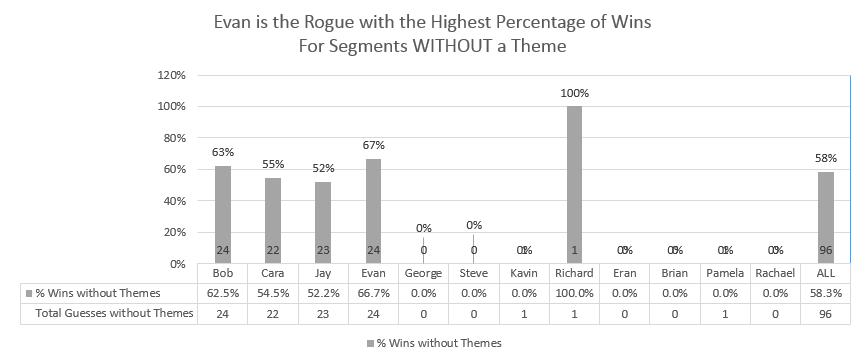

```{r setup, include=FALSE}
knitr::opts_chunk$set(echo = TRUE, warning = FALSE, message = FALSE)
```

``` {r loaddata, echo=FALSE}
library(readxl)
library(dplyr)
library(reshape2)
library(knitr)

```

## Background
The Skeptics Guide to the Universe is a weekly podcast hosted by Dr. Steven Novella.  Each week during this segment of the podcast, Dr. Novella presents his panel of skeptics with 3 or 4 science-related news items, 1 of which is fiction.  And each panelist must determine which is the fiction.

## Year End Episode
At the end of the calendar year, Dr. Novella host a year in review episode where the panel reviews their performance at Science or Fiction.  

## 2017 Summary Facts - Through Episode #649

* Cara ends the year with the highest overall win percentage  
* Bob's perception that segments with themes are harder isn't true overall but is true for him and Evan  
* Cara's performance is much better on segments with themes than without, Jay's is better as well    
* The panel performs better overall when Evan or Bob answer first 
* As expected, answering first is a disadvantage, particularly for Bob which is interesting given that the panel performs the best when Bob answers first.
* Evan has the best performance answering first and he was called on to answer first the fewest times
* There have been 7 panelist sweeps to date and 6 hosts sweeps, 1 by Evan and 5 by Steve  
* Cara has the longest consecutive win streak 6 between episodes 618 - 623
* Jay has the longest consecutive losing streak 5 between episoes 624 - 631

## 2017 Summary Statistics - Through Episode #649
**NOTE: ALL includes contributions from Special Guest Rogues not listed**  
Raw data and some visuals are located in [This Excel file](https://github.com/wayneheller/SGU_Science_or_Fiction/blob/master/SGU_Science_or_Fiction.xlsx) Click the Download button on this github page.

``` {r readstats, echo = FALSE}
pathtofile <- file.path("..",'SGU_Science_or_Fiction.xlsx')
dfSGUSummary <- readxl::read_excel(pathtofile, sheet = 3 )
dfSGUSummary <- as.data.frame(dfSGUSummary)
rownames(dfSGUSummary) <- dfSGUSummary$Statistic
dfSGUSummary <- select(dfSGUSummary, -Statistic)
Rogues <- c("Steve", "Bob", "Evan", "Cara", "Jay")
dfSGUSummary <- select(dfSGUSummary, c(Rogues, "ALL"))
dfSGUSummary <- t(dfSGUSummary)

showStatistic <- function(statName, ispercentage = TRUE) {
    myStat <- dfSGUSummary[, statName]
    myStat <- na.exclude(myStat)
    if (ispercentage) {
        myStat2 <- sprintf("%.1f%%", myStat*100)
    }
    else {
        myStat2 <- sprintf("%.0f", myStat)
    }
    names(myStat2) <- names(myStat)
    
    kable(sort(myStat2, decreasing = TRUE), format.args = list(justify='right', width=500) , rownames=TRUE, digits=2, align = c('l', 'l'), format='html', table.attr = "style='width:15%;'")

}
```

### Overall Win Percentage

``` {r winsOverall, echo = FALSE}
showStatistic('% Wins Overall')

#winsOverall <- dfSGUSummary[, '% Wins Overall']
#winsOverall2 <- sprintf("%.1f%%", winsOverall*100)
#names(winsOverall2) <- names(winsOverall)
#kable(sort(winsOverall2, decreasing = TRUE), format.args = list(justify='right', width=20) , rownames=TRUE, digits=2)

```

### Win Percentage For Segments WITH Themes
``` {r winsThemes, echo = FALSE}
showStatistic('% Wins with Themes')
```

### Win Percentage For Segments WITHOUT Themes
``` {r winswithoutThemes, echo = FALSE}
showStatistic('% Wins without Themes')
```

### Longest Consecutive Winning Streak
``` {r WinStreak, echo = FALSE}
showStatistic('Longest Winning Streak', ispercentage = FALSE)
```

### Longest Consecutive Losing Streak
``` {r LoseStreak, echo = FALSE}
showStatistic('Longest Losing Streak', ispercentage = FALSE)
```

### Panel Performance When Answering First
``` {r PanelPerformance, echo = FALSE}
showStatistic('Panel Performance When Answering First')
```

### Individual Panelist Performance When Answering First
``` {r PanelistPerformance, echo = FALSE}
showStatistic('Panelist Performance When Answering First')
```

### Host Sweeps
``` {r Host Sweeps, echo = FALSE}
showStatistic('Host Sweeps', ispercentage = FALSE)
```

### Panelist Sweeps
``` {r PanelSweeps, echo = FALSE}
showStatistic('Panelist Sweeps', ispercentage = FALSE)
```

## Some Visuals


