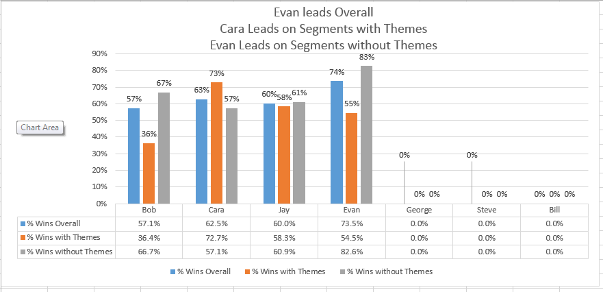

```{r setup, include=FALSE}
knitr::opts_chunk$set(echo = TRUE, warning = FALSE, message = FALSE)
```

``` {r loaddata, echo=FALSE}
library(readxl)
library(dplyr)
library(reshape2)
library(knitr)
library(scales)

debug_flag = FALSE # See description below.  If TRUE, will show the summarization values
Episode_range = 652:687
```

## Background
The Skeptics Guide to the Universe is a weekly podcast hosted by Dr. Steven Novella.  Each week during this segment of the podcast, Dr. Novella presents his panel of skeptics with 3 or 4 science-related news items, 1 of which is fiction.  And each panelist must determine which is the fiction.

## Year End Episode
At the end of the calendar year, Dr. Novella host a year in review episode where the panel reviews their performance at Science or Fiction.  

## 2018 Summary Facts - Episodes# `r Episode_range[1]` - `r tail(Episode_range,1)`
###(Beginning of the Calendar Year Through DragonCon)

* Evan is in the lead this year with the highest overall win percentage, followed by Cara  
* Evan has the most solo wins, followed by Cara.
* Bob's perception that segments with themes are harder isn't true overall but is true for him  
* Cara's performance is much better on segments with themes than without. 
* The panel performs better overall when Cara answers first 
* Relative to other panelists, Bob does well when he is the first to answer.
* There have been 9 panelist sweeps to date (compared to 7 in all of 2017) and 3 hosts sweeps, 1 by Bob and 2 by Steve (Steve had 5 host sweeps last year).    

## 2018 Summary Statistics - Episodes# `r Episode_range[1]` - `r tail(Episode_range,1)` 
**NOTE: ALL includes contributions from Special Guest Rogues not listed**  
Raw data and some visuals are located in [This Excel file](https://github.com/wayneheller/SGU_Science_or_Fiction/blob/master/SGU_Science_or_Fiction.xlsx) Click the Download button on this github page.  

``` {r readstats, echo = FALSE}
# This code has evolved over time, in the first iteration, markdown was simply used to read summary values from the source data
# in Excel and present it on an HTML page published to RPubs.com.  In the next version, the Excel file was modified to put the
# panelist answers on a separate tab in tidy format.  The revised markdown reads the data and does the summarization.  Since
# both versions exist in the same Excel file, this code is able to create a markdown file that shows both, the summary from Excel
# and the calculated summarizations.  Setting the debug_flag to TRUE enables both versions to be shown

pathtofile <- file.path("..",'SGU_Science_or_Fiction.xlsx')
Rogues <- c("Steve", "Bob", "Evan", "Cara", "Jay")


if (debug_flag == TRUE) {
    dfSGUSummary <- readxl::read_excel(pathtofile, sheet = 5 )
    dfSGUSummary <- as.data.frame(dfSGUSummary)
    rownames(dfSGUSummary) <- dfSGUSummary$Statistic
    dfSGUSummary <- select(dfSGUSummary, -Statistic)
    
    dfSGUSummary <- select(dfSGUSummary, c(Rogues, "ALL"))
    dfSGUSummary <- t(dfSGUSummary)
}


dfEpisodeData <- readxl::read_excel(pathtofile, sheet = 1 )
dfEpisodeData <- as.data.frame(dfEpisodeData)
dfEpisodeData <- select(dfEpisodeData, 1:8) %>% filter(Episode %in% Episode_range)
    
    
dfItemsSelected <- readxl::read_excel(pathtofile, sheet =2)
dfItemsSelected <- as.data.frame(dfItemsSelected)
dfItemsSelected <- select(dfItemsSelected, c('Episode', 'Panelist', 'ItemSelected', 'AnsweringOrder'))
dfItemsSelected <- filter(dfItemsSelected, Episode %in% Episode_range)
    

dfFictionItems <- select(dfEpisodeData, c('Episode', 'FictionItem'))
dfItemsSelected <- inner_join(dfItemsSelected, dfFictionItems, by='Episode')
dfItemsSelected$Correct <- mapply(ifelse, test = (dfItemsSelected$ItemSelected == dfItemsSelected$FictionItem), yes = 1, no = 0 )
dfPanelistPerf <- dfItemsSelected %>% select(Episode, AnsweringOrder, Correct, Panelist) %>% filter(Panelist %in% Rogues) %>% group_by(Panelist)
dfOverallPerf <- dfItemsSelected %>% select(Episode, AnsweringOrder, Correct, Panelist) # %>% filter(Panelist %in% Rogues)

# Append number correct for each episode
dfCorrect <- as.data.frame(dfItemsSelected %>% group_by(Episode) %>% summarise(CorrectAnswers = sum(Correct)))
dfEpisodeData <- inner_join(dfEpisodeData, dfCorrect, by='Episode')

# Append panelist who answered first for each episode
dfFirstPanelist <- as.data.frame(dfItemsSelected %>% group_by(Episode) %>% filter(AnsweringOrder==1) %>% select(Episode, FirstPanelist = Panelist))
dfEpisodeData <- inner_join(dfEpisodeData, dfFirstPanelist, by='Episode')

# Append number of panelists for each episode
dfTotalPanelists <- as.data.frame(dfItemsSelected %>% group_by(Episode) %>% summarise(TotalPanelists = n()) %>% select(Episode, TotalPanelists))
dfEpisodeData <- inner_join(dfEpisodeData, dfTotalPanelists, by='Episode')


showStatistic <- function(statName, ispercentage = TRUE) {
    myStat <- dfSGUSummary[, statName]
    myStat <- na.exclude(myStat)
    if (ispercentage) {
        myStat2 <- sprintf("%.1f%%", myStat*100)
    }
    else {
        myStat2 <- sprintf("%.0f", myStat)
    }
    names(myStat2) <- names(myStat)
    
    kable(sort(myStat2, decreasing = TRUE), format.args = list(justify='right', width=500) , rownames=TRUE, col.names=NA, digits=2, align = c('l', 'l'), format='html', table.attr = "style='width:15%;'")

}

showStatistic_2 <- function(lstResults, ispercentage = TRUE) {
    
    kable(lstResults, format.args = list(justify='right', width=500) , rownames=TRUE, col.names=NULL, digits=1, align = c('l', 'l'), format='html', table.attr = "style='width:15%;'")

}

```

### Overall Win Percentage

``` {r winsOverall_debug, echo = FALSE, eval = debug_flag}
showStatistic('% Wins Overall')
```


``` {r winsOverall, echo = FALSE}
# Overall Performance
stat <- dfPanelistPerf %>% summarise(Overall =  percent(sum(Correct)/n())) 
total <- dfOverallPerf %>% summarise(Overall =  percent(sum(Correct)/n())) 
stat <- rbind(stat,c("ALL", total[1,1])) %>% arrange(desc(Overall))
showStatistic_2(stat)
```

### Win Percentage For Segments WITH Themes
``` {r winsThemes_debug, echo = FALSE, eval = debug_flag}
showStatistic('% Wins with Themes')
```

``` {r winsThemes, echo = FALSE}
stat <- dfPanelistPerf %>% filter(Episode %in% dfEpisodeData[!is.na(dfEpisodeData$Theme), 'Episode']) %>% summarise(pctThemes = percent(sum(Correct)/n())) 
total <- dfOverallPerf %>% filter(Episode %in% dfEpisodeData[!is.na(dfEpisodeData$Theme), 'Episode']) %>% summarise(pctThemes = percent(sum(Correct)/n())) 
stat <- rbind(stat,c("ALL", total[1,1])) %>% arrange(desc(pctThemes))
showStatistic_2(stat)
```

### Win Percentage For Segments WITHOUT Themes
``` {r winswithoutThemes_debug, echo = FALSE, eval = debug_flag}
showStatistic('% Wins without Themes')
```

``` {r winswithoutThemes, echo = FALSE}
stat <- dfPanelistPerf %>% filter(Episode %in% dfEpisodeData[is.na(dfEpisodeData$Theme), 'Episode']) %>% summarise(pctThemes = percent(sum(Correct)/n()))
total <- dfOverallPerf %>% filter(Episode %in% dfEpisodeData[is.na(dfEpisodeData$Theme), 'Episode']) %>% summarise(pctThemes = percent(sum(Correct)/n())) 
stat <- rbind(stat,c("ALL", total[1,1])) %>% arrange(desc(pctThemes))
showStatistic_2(stat)
```

### Solo Wins
``` {r SoloWins_debug, echo = FALSE, eval = debug_flag}
showStatistic('Solo Wins', ispercentage = FALSE)
```

``` {r SoloWins, echo = FALSE}
dfSoloWins <- dfItemsSelected[dfItemsSelected$Episode %in% dfEpisodeData[dfEpisodeData$CorrectAnswers==1, 'Episode'] & dfItemsSelected$Correct==1, c('Episode', 'Panelist')]
stat <- dfSoloWins %>% group_by(Panelist) %>% summarise(SoloWins = n()) %>% arrange(desc(SoloWins))
total <- dfSoloWins  %>% summarise(SoloWins = n()) 
stat <- rbind(stat,c("TOTAL", total[1,1])) 
showStatistic_2(stat)
```

### Longest Consecutive Winning Streak
``` {r WinStreak_debug, echo = FALSE, eval = debug_flag}
showStatistic('Longest Winning Streak', ispercentage = FALSE)
```

``` {r WinStreak, echo = FALSE}
wins = list()
losses = list()
for (rogue in Rogues) {
    df <- dfItemsSelected %>% filter(Panelist == rogue)
    x = rle(df$Correct)
    wins[rogue] = max(x$lengths[x$values == 1])
    losses[rogue] = max(x$lengths[x$values == 0])
}
wins <- wins[order(unlist(wins),decreasing=TRUE)]
wins <- wins[wins >= 0]
stat <- t(as.data.frame(wins))

showStatistic_2(stat)
```

### Longest Consecutive Losing Streak
``` {r LoseStreak_debug, echo = FALSE, eval = debug_flag}
showStatistic('Longest Losing Streak', ispercentage = FALSE)
```
``` {r LoseStreak, echo = FALSE}
losses <- losses[order(unlist(losses),decreasing=TRUE)]
losses <- losses[losses >= 0]
stat <- t(as.data.frame(losses))
showStatistic_2(stat)
```

### Panel Performance When Answering First
#### A measure of how well the other rogues perform based on who answers first

``` {r PanelPerformance_debug, echo = FALSE, eval = debug_flag}
showStatistic('Panel Performance When Answering First')
```
``` {r PanelPerformance, echo = FALSE}
stat <- dfEpisodeData %>% filter(FirstPanelist %in% Rogues) %>% group_by(FirstPanelist) %>% summarise(PanelPerformance = percent(sum(CorrectAnswers)/sum(TotalPanelists))) %>% arrange(desc(PanelPerformance))
showStatistic_2(stat)
```

### Individual Panelist Performance When Answering First
#### A measure of an individuals performance when answering first
``` {r PanelistPerformance_debug, echo = FALSE, eval = debug_flag}
showStatistic('Panelist Performance When Answering First')
```
``` {r PanelistPerformance, echo = FALSE}
stat <- dfPanelistPerf %>% filter(AnsweringOrder==1) %>% summarise(pctAnsweringFirst = percent(sum(Correct)/n())) %>% arrange(desc(pctAnsweringFirst))
total <- dfOverallPerf %>% filter(AnsweringOrder==1) %>% summarise(pctAnsweringFirst = percent(sum(Correct)/n())) %>% arrange(desc(pctAnsweringFirst))
stat <- rbind(stat,c("ALL", total[1,1])) %>% arrange(desc(pctAnsweringFirst))
showStatistic_2(stat)
```

### Host Sweeps
``` {r HostSweeps_debug, echo = FALSE, eval = debug_flag}
showStatistic('Host Sweeps', ispercentage = FALSE)
```

``` {r HostSweeps, echo = FALSE}
dfHostSweeps <- dfEpisodeData[dfEpisodeData$CorrectAnswers==0, c('Episode', 'Host')]
stat <- dfHostSweeps %>% group_by(Host) %>% summarize(HostSweeps = n()) %>% arrange(desc(HostSweeps))
total <- dfHostSweeps %>% summarize(HostSweeps = n())
stat <- rbind(stat,c("TOTAL", total[1,1])) 
showStatistic_2(stat)
```

### Panelist Sweeps
#### How many times a panelist has participated in a sweep of the host
``` {r PanelSweeps_debug, echo = FALSE, eval = debug_flag}
showStatistic('Panelist Sweeps', ispercentage = FALSE)
```

``` {r PanelSweeps, echo = FALSE}
stat <- dfItemsSelected[dfItemsSelected$Episode %in% dfEpisodeData[dfEpisodeData$CorrectAnswers == dfEpisodeData$TotalPanelists,"Episode"],] %>% group_by(Panelist) %>% summarise(PanelistSweeps = n()) %>% arrange(desc(PanelistSweeps))
showStatistic_2(stat)
```

## Some Visuals
